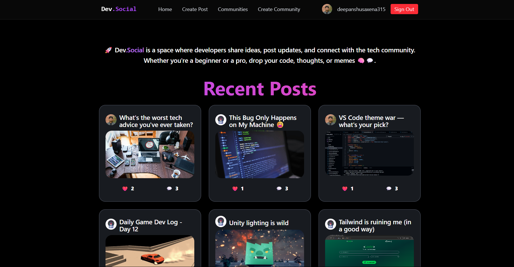
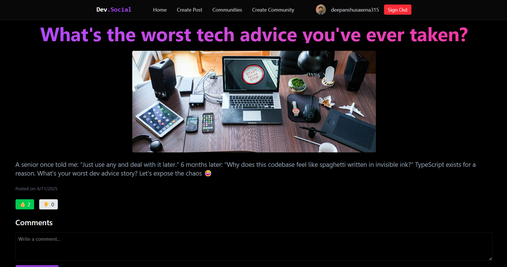
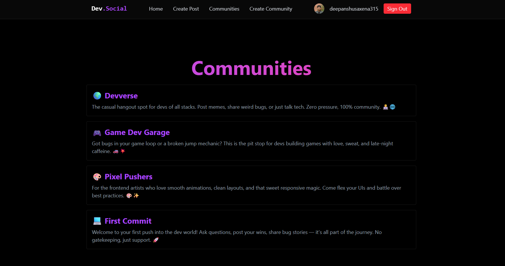

# 🌐 DevSocial

A social media platform made **by developers, for developers**. Think Reddit meets GitHub — post, comment, share bugs and wins across tech communities.

🔗 [Live Demo → devsocial-dtu.vercel.app](https://devsocial-dtu.vercel.app)

---
## 📸 Screenshots

> Here's a preview of the DevSocial UI in action:

| Home Feed | Post View | Auth |
|-----------|-----------|------|
|  |  |  |


## ⚙️ Tech Stack

- ⚛️ **React** – UI building with component-based design
- ⚡ **Vite** – Lightning-fast dev and build tooling
- 🧠 **TypeScript** – Type-safe, scalable frontend logic
- 🐘 **Supabase** – Auth, real-time DB, and storage backend
- 🎨 **Tailwind CSS** – Utility-first styling for a beautiful, responsive UI

---

## ⚡️ Features

### 🔐 User Authentication via GitHub
- Log in securely using GitHub OAuth
- Display GitHub avatars and usernames on posts, comments, and more

### 📝 Post Creation with Image Uploads
- Create posts with a title, content, and optional image
- Uploads are stored in Supabase with secure public URLs

### 👍 Dynamic Voting System
- Upvote or downvote posts
- Active votes glow subtly to reflect interaction

### 💬 Robust Commenting System
- Threaded comment replies with nested structure
- Includes timestamps and user avatars for context

### 🏘️ Community & Category Support
- Organize content into tech-specific communities:
  - 💻 First Commit
  - 🎮 Game Dev Garage
  - 🎨 Pixel Pushers
  - 🌍 Devverse
- Users can post within a category and browse accordingly

### 💎 Modern Glassmorphism UI
- Clean, aesthetic interface with glowing gradients and glassy cards
- Subtle transitions and hover effects across the site

### 🔄 Real-Time Data Updates
- Powered by **Supabase** + **React Query**
- Posts, votes, and comments reflect instantly without reloads

---


---

## 🛠️ Local Setup

1. Clone this repo:
   ```bash
   git clone https://github.com/deepanshusaxena315/DevSocial-socialmedia-app.git
   cd DevSocial-socialmedia-app
   ```

2. Install dependencies:
   ```bash
   npm install
   ```

3. Add environment variables to `.env.local`:
   ```env
   VITE_SUPABASE_URL=<your-supabase-url>
   VITE_SUPABASE_ANON_KEY=<your-supabase-anon-key>
   ```

4. Start the dev server:
   ```bash
   npm run dev
   ```

---

## ✨ Future Ideas

- Add profile pages
- Show trending posts by upvotes
- Mobile-first redesign
- Light/dark theme toggle
- Infinite scroll

---

## 📄 License

MIT © [Deepanshu Saxena](https://github.com/deepanshusaxena315)

---

Built with love at **DTU 💙**